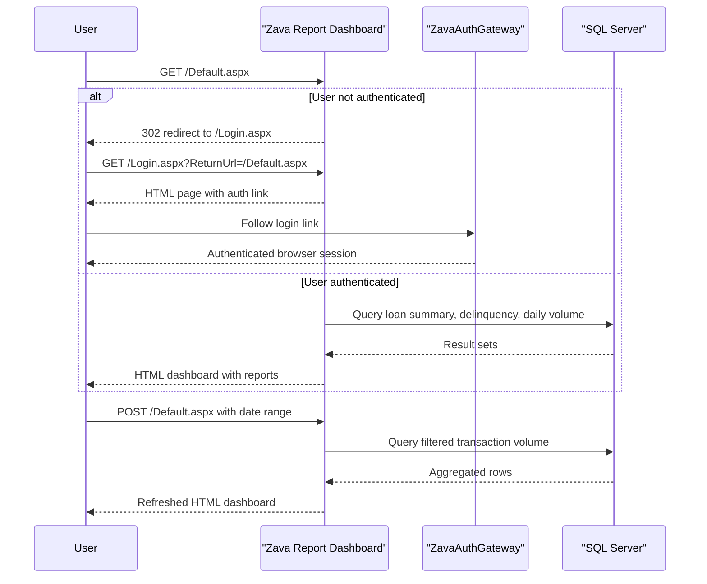

# API & Service Communication Contracts

This application exposes a very small HTTP surface consisting of Web Forms pages rather than a JSON API. Communication is synchronous and limited to browser page requests, SQL Server queries, and redirects to an external authentication gateway.

## Service Catalog

| Service | Port | Category | Purpose |
| --- | --- | --- | --- |
| Zava Report Dashboard | 8080 in container, default ASP.NET host otherwise | API Layer | Renders authenticated reporting pages for managers and administrators |
| ZavaAuthGateway | Configured by URL, port not pinned in repo | Infrastructure | Performs centralized login and logout flows for the dashboard |
| SQL Server ZavaBankDB | 1433 from configured connection string | Infrastructure | Stores reporting data queried by the dashboard |

## API Endpoints Inventory

| Service | Method | Path | Request Type | Response Type |
| --- | --- | --- | --- | --- |
| Zava Report Dashboard | GET | /Login.aspx | Query string ReturnUrl | HTML page with redirect link to auth gateway |
| Zava Report Dashboard | GET | /Logout.aspx | None | Redirect response to gateway logout page |
| Zava Report Dashboard | GET | /Default.aspx | Authenticated request, optional existing ViewState | HTML dashboard page with report widgets |
| Zava Report Dashboard | POST | /Default.aspx | Form postback with txtStartDate and txtEndDate | HTML dashboard refresh with updated report tables |

## Management & Observability Endpoints

| Service | Endpoint | Custom Metrics (if any) |
| --- | --- | --- |
| Zava Report Dashboard | None detected | None detected |

## DTOs & Contracts

The application does not define explicit API DTO classes, records, or OpenAPI contracts. Input is handled through Web Forms controls and query-string values such as `ReturnUrl`, `txtStartDate`, and `txtEndDate`, while outputs are rendered as HTML tables and GridView responses backed by ADO.NET `DataTable` instances.

## Communication Patterns

All runtime communication is synchronous. Browser requests are handled directly by ASP.NET Web Forms pages, report queries are executed against SQL Server through `SqlConnection` and `SqlCommand`, and unauthenticated users are redirected to externally configured login/logout endpoints. No asynchronous messaging, retry policy, circuit breaker, service discovery, or API gateway aggregation layer is implemented. Security posture is limited to Forms Authentication plus external redirect-based sign-in; the configured gateway URLs use HTTP rather than HTTPS, and no API-specific authorization or TLS configuration is defined in the repository.

## Service Technology Matrix

| Service | Web | Data Access | Discovery | Gateway | Actuator | Cache | Metrics |
| --- | --- | --- | --- | --- | --- | --- | --- |
| Zava Report Dashboard | ASP.NET Web Forms | ADO.NET with SQL Server | None | No | No | No | No |
| ZavaAuthGateway | External web app | Unknown | None | External auth provider | Unknown | Unknown | Unknown |

## Service Communication Sequence

