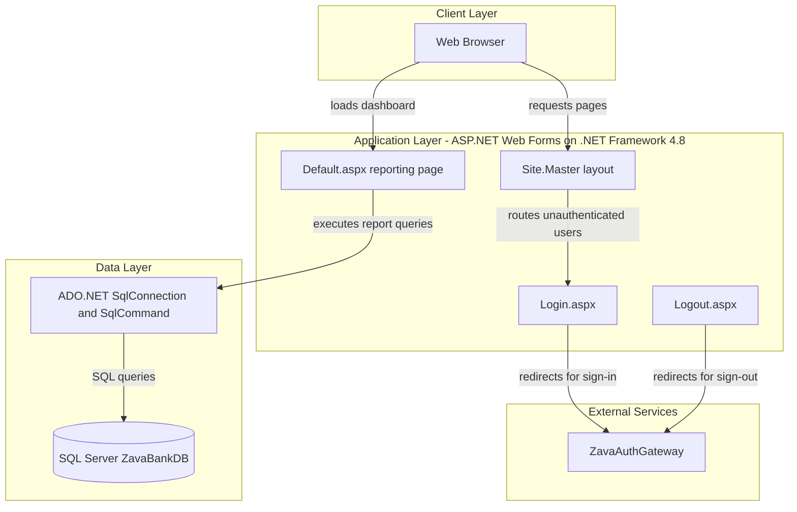
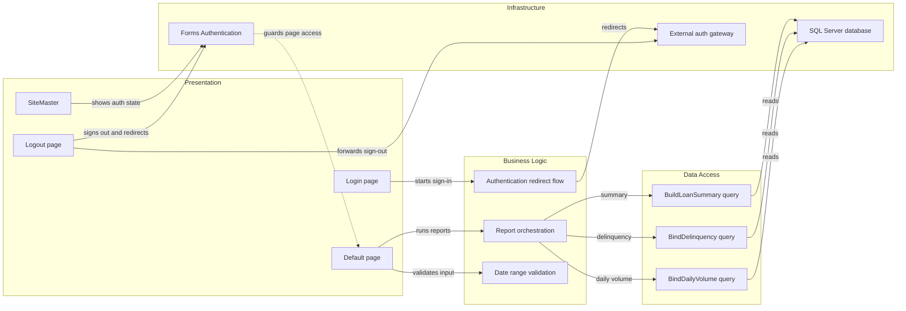

# Architecture Diagram

This document summarizes the dashboard architecture and the main runtime relationships found in the repository. The application is a small ASP.NET Web Forms site that renders reports directly from SQL queries and relies on an external authentication gateway.

## Application Architecture

### Technology Stack Summary

| Layer | Technology | Version | Purpose |
| --- | --- | --- | --- |
| Presentation | ASP.NET Web Forms | .NET Framework 4.8 | Renders login, logout, and reporting pages |
| UI Composition | Site.Master, UpdatePanel, GridView, Literal | Framework-provided | Shared shell and partial page updates for reports |
| Data Access | ADO.NET via SqlConnection, SqlCommand, SqlDataAdapter | Framework-provided | Executes direct SQL queries and binds results to controls |
| Data Storage | Microsoft SQL Server | Not pinned in repo | Stores loan application, payment, and transaction reporting data |
| Hosting | Mono XSP4 container | 6.12 base image | Containerized runtime for the Web Forms site |

### Data Storage & External Services

The application connects to a single SQL Server database identified as ZavaBankDB and reads reporting data from LoanApplications, LoanPayments, and Transactions. Authentication is delegated to a separate ZavaAuthGateway application by redirecting users to configured login and logout URLs.

### Key Architectural Decisions

- Uses server-rendered Web Forms pages rather than a separate API plus SPA architecture.
- Accesses reporting data through inline SQL in page code-behind instead of a repository or ORM layer.
- Delegates authentication to an external gateway while enforcing Forms Authentication locally for page access.

## Component Relationships

### Component Inventory

| Component | Layer | Type | Responsibility |
| --- | --- | --- | --- |
| SiteMaster | Presentation | Master page | Renders shared navigation and user status |
| Login page | Presentation | Web Forms page | Redirects unauthenticated users to the external auth gateway |
| Default page | Presentation | Web Forms page | Accepts date filters and renders reporting widgets |
| Logout page | Presentation | Web Forms page | Signs the user out locally and redirects to gateway logout |
| Authentication redirect flow | Business Logic | Page orchestration | Builds login and logout redirect targets |
| Report orchestration | Business Logic | Page method group | Refreshes summary, delinquency, and volume reports |
| Date range validation | Business Logic | Validation rule | Rejects invalid or reversed date ranges |
| BuildLoanSummary query | Data Access | ADO.NET query routine | Aggregates applications by status |
| BindDelinquency query | Data Access | ADO.NET query routine | Lists overdue unpaid loan payments |
| BindDailyVolume query | Data Access | ADO.NET query routine | Aggregates transaction volume by day |
| Forms Authentication | Infrastructure | Security mechanism | Tracks authenticated users and guards protected pages |
| External auth gateway | Infrastructure | External web app | Performs centralized sign-in and sign-out |
| SQL Server database | Infrastructure | Database | Stores reporting source data |
