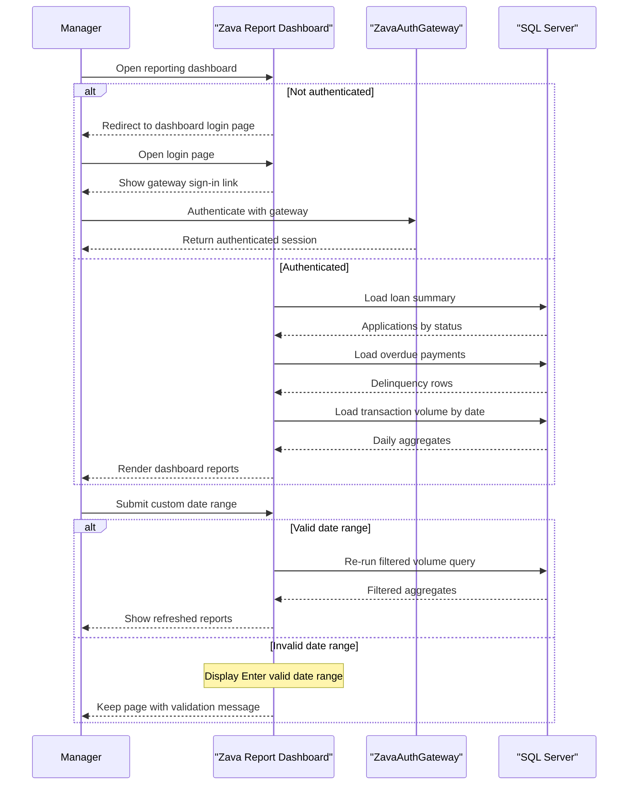

# Core Business Workflows

This application serves as a manager-facing reporting portal for loan and transaction oversight. Its main business value is authenticating privileged users and presenting operational loan summaries, delinquency data, and transaction volume metrics.

## Domain Entities

| Entity | Service / Bounded Context | Description | Key Relationships |
| --- | --- | --- | --- |
| Loan Application | Reporting Dashboard | Represents a lending request summarized by approval status and amounts | Linked to loan payments and related transaction activity |
| Loan Payment | Reporting Dashboard | Represents scheduled payment obligations used to detect overdue accounts | Belongs to a loan application and contributes to delinquency reporting |
| Transaction | Reporting Dashboard | Represents account activity summarized into daily volume metrics | Associated with reporting date windows and loan activity |
| Manager Session | Authentication context | Represents an authenticated dashboard user session | Required before access to reporting pages is allowed |

## Service-to-Domain Mapping

| Service | Domain Context | Owned Entities | External Dependencies |
| --- | --- | --- | --- |
| Zava Report Dashboard | Reporting and operational monitoring | Loan Application, Loan Payment, Transaction, Manager Session | SQL Server database, ZavaAuthGateway |
| ZavaAuthGateway | User authentication | Manager Session upstream identity | Redirect target configured by URL |

## Primary Workflows

### Workflow 1: Authenticate manager access

A browser request to the reporting dashboard first checks whether the current ASP.NET identity is authenticated. Unauthenticated users are redirected to `Login.aspx`, which provides a continuation link to the external authentication gateway and includes the original return URL so the user can come back to the dashboard after sign-in.

### Workflow 2: View reporting dashboard

Once authenticated, the default dashboard page initializes a seven-day reporting window and loads three report sections: loan portfolio summary, delinquency reporting, and daily transaction volume. Each section is populated from the database and rendered directly into HTML controls for managerial review.

### Workflow 3: Refresh reports for a custom date range

When a user posts a new start date and end date, the dashboard validates that both values parse as dates and that the end date is not earlier than the start date. If validation passes, the page re-runs the report queries and updates the displayed widgets; otherwise it shows a validation message and leaves the existing state unchanged.

## Cross-Service Data Flows

Cross-service interaction is limited to authentication redirection. The dashboard depends on the external auth gateway to establish a valid user session, while all report data stays within the dashboard plus SQL Server boundary. No additional downstream business services, event flows, or API composition layers are present.

## Business Workflow Sequence

## Business Rules & Decision Logic

- Users must already be authenticated before the reporting dashboard can be viewed; otherwise the application redirects them to the login flow.
- A reporting date range is valid only when both inputs parse as dates and the end date is not earlier than the start date.
- The delinquency report includes only payments with a due date earlier than the current time and a status other than `Paid`.
- The portfolio summary groups loan applications by status and computes requested and approved amount totals for each group.
- Daily transaction volume is aggregated by calendar day and sums the absolute value of transaction amounts across the selected window.
