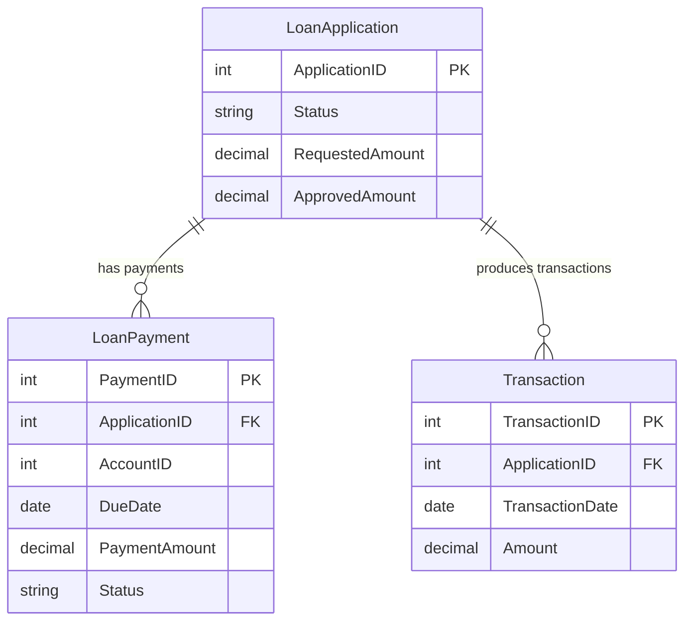

# Data Architecture & Persistence Layer

This application uses a single relational database and a very thin persistence layer based on direct ADO.NET queries. No ORM entities or repository abstractions are present in the codebase, so the data model below is inferred from the SQL used by the reporting page.

## Database Configuration

| Service/Module | DB Type | Profile | Driver | Connection | Migration Tool |
| --- | --- | --- | --- | --- | --- |
| Zava Report Dashboard | SQL Server | Default | System.Data.SqlClient | Named connection string `ZavaBankDb` in `web.config` | None detected |

## Data Ownership per Service

| Service | Tables Owned | ORM Framework | Caching | Notes |
| --- | --- | --- | --- | --- |
| Zava Report Dashboard | LoanApplications, LoanPayments, Transactions | None; direct ADO.NET | None detected | Read-oriented reporting queries only; ownership inferred from SQL usage |

## Entity Model

## Key Repository Methods

| Service | Repository | Notable Methods | Purpose |
| --- | --- | --- | --- |
| Zava Report Dashboard | Default.aspx.cs page methods | `BuildLoanSummary()` | Aggregates loan applications by status and total amounts |
| Zava Report Dashboard | Default.aspx.cs page methods | `BindDelinquency()` | Retrieves the top 50 overdue unpaid loan payment rows |
| Zava Report Dashboard | Default.aspx.cs page methods | `BindDailyVolume(DateTime s, DateTime e)` | Aggregates transaction counts and absolute volume by day for a selected range |

## Caching Strategy

No application-level caching layer is configured. Each dashboard refresh opens a SQL connection and re-executes the underlying query set, so the application behaves as a simple cacheless read-through reporting UI over the backing database.

## Data Ownership Boundaries

The repository shows a single application reading from a single shared SQL Server database. There is no evidence of separate service-owned schemas, replicated read models, or cross-service persistence boundaries; all report data access happens in-process through direct SQL statements inside the dashboard page.

### Data Classification & Sensitivity

| Entity | Sensitive Fields | Classification (PII/PHI/PCI/None) | Controls in Place |
| --- | --- | --- | --- |
| LoanApplication | RequestedAmount, ApprovedAmount | None | No encryption, masking, or field-level controls visible in repository; values are still financially sensitive |
| LoanPayment | AccountID, PaymentAmount, DueDate | None | No encryption, masking, or field-level controls visible in repository; values are still financially sensitive |
| Transaction | Amount, TransactionDate | None | No encryption, masking, or field-level controls visible in repository; values are still financially sensitive |
