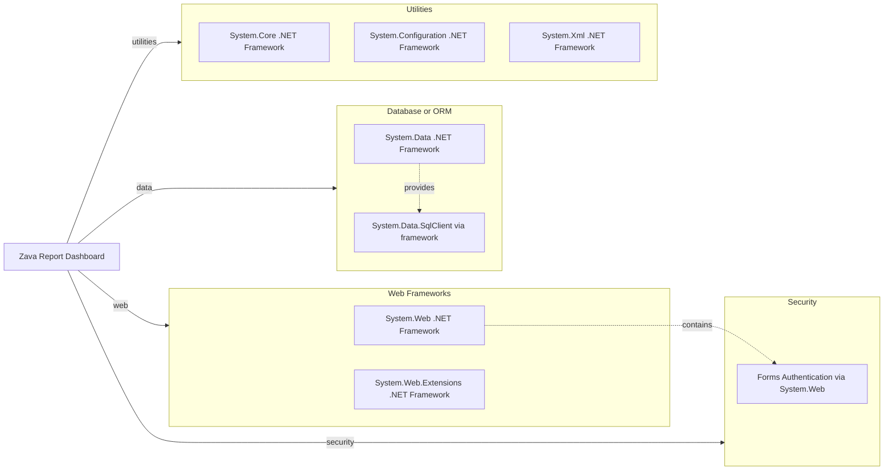

# Dependency Map

This document summarizes the declared framework dependencies for Zava Report Dashboard. The repository has a very small dependency surface and relies almost entirely on .NET Framework assemblies rather than external NuGet packages.

## Dependencies

### Dependency Summary

| Category | Count | Key Libraries | Notes |
| --- | --- | --- | --- |
| Web Frameworks | 2 | System.Web, System.Web.Extensions | Provides ASP.NET Web Forms pages and partial-page update controls |
| Database or ORM | 2 | System.Data, System.Data.SqlClient | Direct ADO.NET data access with handwritten SQL |
| Security | 1 | Forms Authentication in System.Web | Local auth cookie enforcement combined with external gateway redirects |
| Utilities | 3 | System.Core, System.Configuration, System.Xml | General runtime, configuration, and XML support |

### Version & Compatibility Risks

The project targets .NET Framework 4.8, which is a legacy Windows-oriented runtime and requires compatibility work for modernization to modern .NET. The Dockerfile depends on Mono 6.12 to host Web Forms, which further indicates reliance on older platform capabilities rather than a current LTS web stack.

### Notable Observations

- `packages.config` is empty, so the application depends on framework assemblies instead of a managed NuGet dependency graph.
- No separate logging, caching, ORM, or observability libraries are declared in project metadata.
- Data access is tightly coupled to page code-behind through ADO.NET and inline SQL statements.

## Test Dependencies

| Framework | Version | Notes |
| --- | --- | --- |
| None detected | N/A | No test-scoped packages or test projects were found |

Total test-scope dependencies: 0

No test dependencies detected. The repository currently has no dedicated unit or integration test infrastructure.
