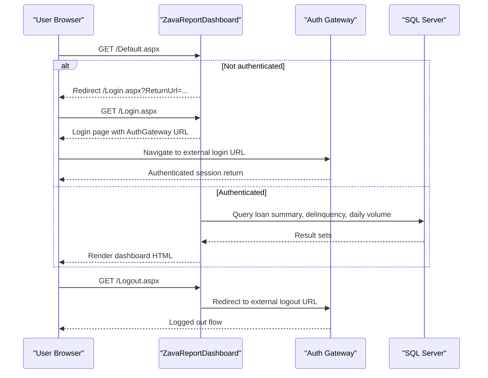

# API & Service Communication Contracts

The application exposes server-rendered Web Forms pages rather than a REST API surface, with synchronous communication to SQL Server and redirect-based interaction with an external authentication gateway. Service communication is primarily in-process page-to-data access calls.

## Service Catalog

| Service | Port | Category | Purpose |
|---|---:|---|---|
| ZavaReportDashboard (Web Forms app) | 8080 (container) | API Layer | Serves login, dashboard, and logout pages for report consumers |
| SQL Server (external dependency) | 1433 | Infrastructure | Stores loan applications, loan payments, and transactions queried by dashboard |
| Auth Gateway (external dependency) | 80 (configured URL) | Infrastructure | Handles centralized login/logout user authentication flow |

## API Endpoints Inventory

| Service | Method | Path | Request Type | Response Type |
|---|---|---|---|---|
| ZavaReportDashboard | GET | /Login.aspx | Query: ReturnUrl | HTML page with gateway login link |
| ZavaReportDashboard | GET | /Default.aspx | Cookie-authenticated request | HTML dashboard with report data |
| ZavaReportDashboard | POST | /Default.aspx | Form body: start/end date | HTML dashboard with refreshed report tables |
| ZavaReportDashboard | GET | /Logout.aspx | Cookie-authenticated request | Redirect to configured auth logout URL |

## Management & Observability Endpoints

| Service | Endpoint | Custom Metrics (if any) |
|---|---|---|
| ZavaReportDashboard | None detected in source/config | None detected |

## DTOs & Contracts

No dedicated API DTO classes were detected. Contracts are page-level form/query interactions (`ReturnUrl`, date range fields) and tabular response rendering through ASP.NET server controls (`GridView`, literal HTML table output). Data contract semantics are implicit in SQL query result sets and Web Forms control binding.

## Communication Patterns

- **Synchronous**: Browser requests page endpoints; page code-behind executes synchronous ADO.NET queries and binds results.
- **Asynchronous**: No async messaging patterns detected (no queue or event broker usage).
- **Resilience**: No explicit retry, timeout policy, or circuit breaker library detected at service-contract level.
- **Service discovery**: None; external dependencies are configured via static connection string and appSettings URLs.
- **Startup dependency chain**: Dashboard availability depends on SQL Server reachability and valid auth gateway URL configuration.
- **Security posture**: Forms authentication is enabled with authorization denying anonymous users except login/logout pages; no explicit TLS enforcement is configured in this repository.

## Service Technology Matrix

| Service | Web | Data Access | Discovery | Gateway | Actuator | Cache | Metrics |
|---|---|---|---|---|---|---|---|
| ZavaReportDashboard | ASP.NET Web Forms | ADO.NET SqlClient | None | External auth redirect | None | None detected | None detected |

## Service Communication Sequence

