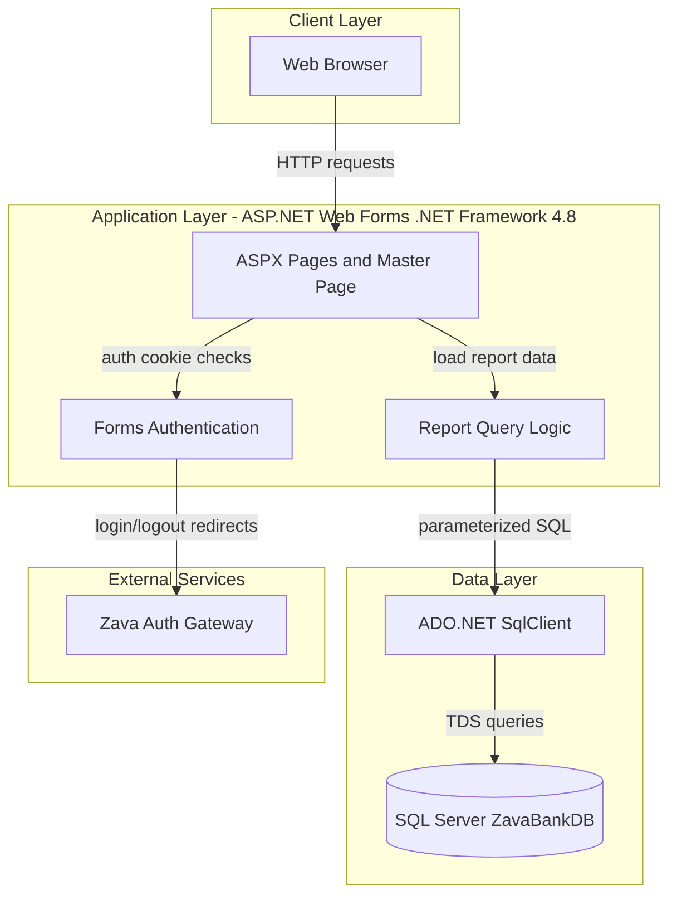
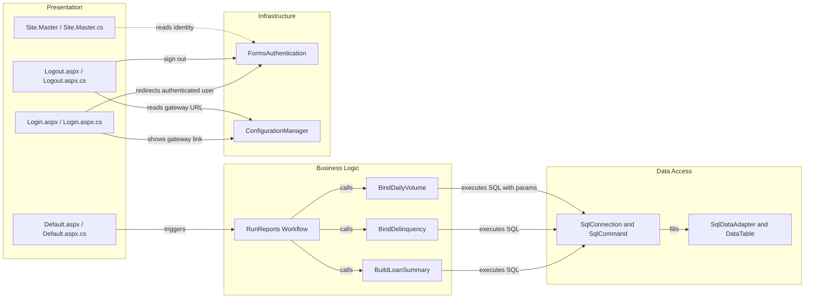

# Architecture Diagram

This application is a single-module ASP.NET Web Forms dashboard that serves authenticated users and reads report data from SQL Server. The architecture is a classic server-rendered UI with direct ADO.NET data access and external redirect-based authentication integration.

## Application Architecture

### Technology Stack Summary

| Layer | Technology | Version | Purpose |
|---|---|---|---|
| Presentation | ASP.NET Web Forms | .NET Framework 4.8 | Server-rendered dashboard pages |
| Authentication | Forms Authentication | .NET Framework System.Web | Cookie-based access control with login redirects |
| Business/Query Logic | C# code-behind | C# on .NET Framework 4.8 | Validate date ranges and orchestrate report queries |
| Data Access | ADO.NET SqlClient | System.Data.SqlClient | Execute SQL queries and bind results to UI controls |
| Data Store | SQL Server | Not pinned in repo | Source of loan/payment/transaction reporting data |

### Data Storage & External Services

The dashboard queries SQL Server (`ZavaBankDb` connection string) directly from page code-behind for loan summary, delinquency, and daily transaction volume reporting. External authentication is delegated through configured login/logout URLs that redirect users to a separate auth gateway.

### Key Architectural Decisions

- Uses server-side Web Forms and code-behind event handlers instead of a separate API layer.
- Keeps reporting queries close to UI page logic with direct ADO.NET usage.
- Integrates authentication through FormsAuth and external gateway redirect URLs from configuration.

## Component Relationships

### Component Inventory

| Component | Layer | Type | Responsibility |
|---|---|---|---|
| Login.aspx.cs | Presentation | Web Forms Page | Handles login entry and gateway redirect URL generation |
| Default.aspx.cs | Presentation | Web Forms Page | Entry point for report refresh actions |
| RunReports | Business Logic | Workflow method | Validates input dates and coordinates report sections |
| BuildLoanSummary | Business Logic | Query builder | Produces HTML summary table from loan aggregates |
| BindDelinquency | Business Logic | Data binding method | Loads delinquent payments into GridView |
| BindDailyVolume | Business Logic | Data binding method | Loads date-filtered transaction volume into GridView |
| SqlConnection/SqlCommand | Data Access | ADO.NET API | Executes SQL queries against SQL Server |
| FormsAuthentication | Infrastructure | Security component | Cookie auth checks and sign-out operations |
| ConfigurationManager | Infrastructure | Config provider | Resolves connection string and auth gateway URLs |
