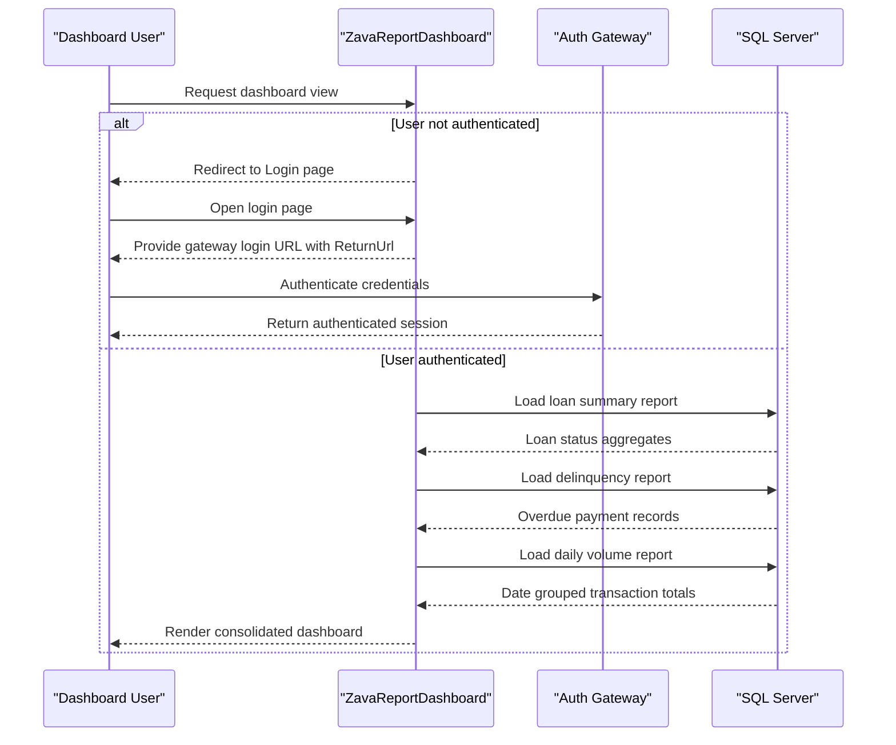

# Core Business Workflows

The application supports authenticated operational reporting for loan and transaction monitoring. Core business behavior centers on user access control and generating date-scoped dashboard summaries for financial oversight.

## Domain Entities

| Entity | Service / Bounded Context | Description | Key Relationships |
|---|---|---|---|
| Loan Application | Reporting Dashboard | Represents loan request lifecycle summarized by status and approval amounts | Parent context for payment and transaction reporting |
| Loan Payment | Reporting Dashboard | Represents scheduled/overdue payments used for delinquency monitoring | Linked to loan application and account context |
| Transaction | Reporting Dashboard | Represents account activity used for daily volume analytics | Linked by account context to loan/payment reporting views |
| User Session | Access Control | Represents authenticated dashboard user context | Governs access to dashboard workflows |

## Service-to-Domain Mapping

| Service | Domain Context | Owned Entities | External Dependencies |
|---|---|---|---|
| ZavaReportDashboard | Reporting and Access Control | Loan Application (read), Loan Payment (read), Transaction (read), User Session | SQL Server, Auth Gateway |

## Primary Workflows

### Workflow 1: Authenticate and Enter Dashboard

User opens the dashboard entry path. If unauthenticated, the app redirects to login and presents an external auth-gateway URL with ReturnUrl continuity. After authentication, the user is returned with an authenticated session and gains access to report views.

### Workflow 2: Refresh Reporting Range

An authenticated user submits start/end dates on the dashboard. The workflow validates date range, then executes summary, delinquency, and daily volume queries and renders refreshed reporting tables. Invalid ranges are rejected with a user-visible validation message.

### Workflow 3: Sign Out

User triggers logout. The app clears FormsAuth session and redirects the browser to configured auth-gateway logout endpoint to complete sign-out.

## Cross-Service Data Flows

The dashboard service composes data from SQL Server into a single reporting page, joining multiple report slices (loan summary, delinquency list, daily transaction volume) within the same request flow. Authentication-related data flow is delegated to an external auth gateway via redirect URLs; if gateway endpoints are unavailable, login/logout user journey is degraded.

## Business Workflow Sequence

## Business Rules & Decision Logic

- Dashboard access requires authenticated session; anonymous users are denied except login/logout paths.
- Date range rule: both dates must parse and end date must be greater than or equal to start date.
- Reporting refresh executes three report slices in sequence and updates UI state when successful.
- Logout rule always invalidates current FormsAuth session before external logout redirect.
