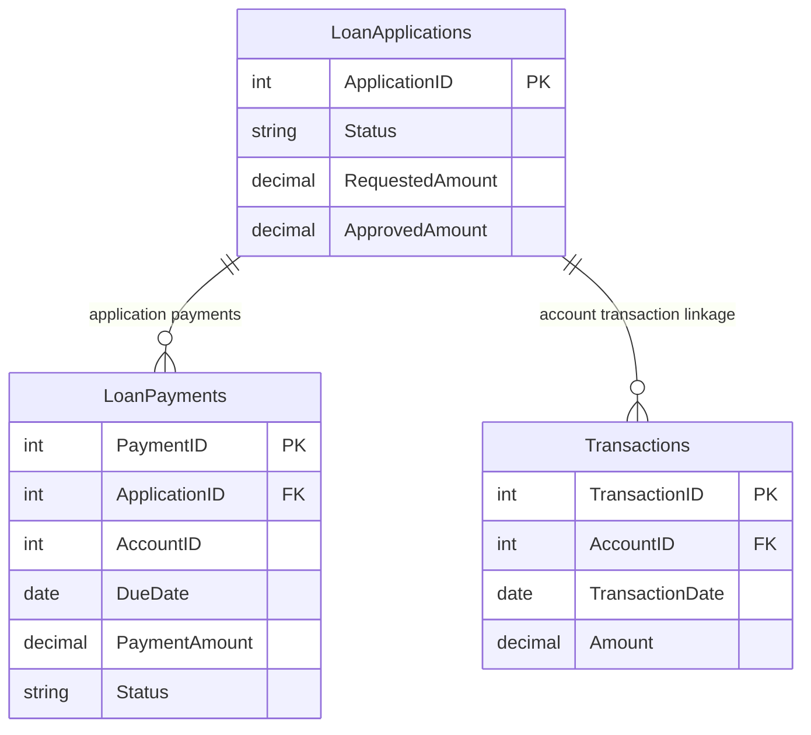

# Data Architecture & Persistence Layer

The data layer is a direct SQL Server persistence model accessed from Web Forms code-behind through ADO.NET. No ORM entities are defined in source; data contracts are query result sets bound to UI controls.

## Database Configuration

| Service/Module | DB Type | Profile | Driver | Connection | Migration Tool |
|---|---|---|---|---|---|
| ZavaReportDashboard | SQL Server | Default (web.config) | System.Data.SqlClient | Named connection string `ZavaBankDb` to `sqlserver,1433` / `ZavaBankDB` | None detected |

## Data Ownership per Service

| Service | Tables Owned | ORM Framework | Caching | Notes |
|---|---|---|---|---|
| ZavaReportDashboard | LoanApplications, LoanPayments, Transactions (queried) | None (ADO.NET only) | None detected | Single app directly querying reporting tables |

## Entity Model

## Key Repository Methods

| Service | Repository | Notable Methods | Purpose |
|---|---|---|---|
| ZavaReportDashboard | Default.aspx.cs (ADO.NET query methods) | `BuildLoanSummary()` | Aggregates applications and requested/approved totals by status |
| ZavaReportDashboard | Default.aspx.cs (ADO.NET query methods) | `BindDelinquency()` | Retrieves overdue loan payments for delinquency view |
| ZavaReportDashboard | Default.aspx.cs (ADO.NET query methods) | `BindDailyVolume(DateTime s, DateTime e)` | Retrieves date-filtered transaction volume metrics |

## Caching Strategy

No cache provider, cache API, or cache annotations were detected. Each dashboard refresh executes SQL queries directly and binds fresh results.

## Data Ownership Boundaries

A single service performs direct read access against SQL Server tables using a shared connection string; no multi-service database boundary or CQRS split was detected. Cross-service data composition is not implemented in this repository, and reporting reads occur synchronously in the web application process.

### Data Classification & Sensitivity

| Entity | Sensitive Fields | Classification (PII/PHI/PCI/None) | Controls in Place |
|---|---|---|---|
| LoanApplications | Not inferable from current query projection | Potential PII (context dependent) | No field-level controls visible in repo |
| LoanPayments | AccountID, payment status context | Potential financial sensitive data | No masking or encryption controls visible in repo |
| Transactions | AccountID, Amount, TransactionDate | Potential financial sensitive data | No masking or encryption controls visible in repo |

