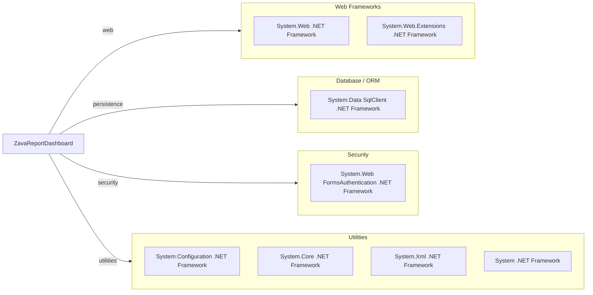

# Dependency Map

ZavaReportDashboard is a .NET Framework Web Forms application with a small declared dependency surface focused on framework-provided libraries. The project declares 7 non-test external/framework dependencies in build metadata.

## Dependencies

### Dependency Summary

| Category | Count | Key Libraries | Notes |
|---|---:|---|---|
| Web Frameworks | 2 | System.Web, System.Web.Extensions | ASP.NET Web Forms runtime stack |
| Database / ORM | 1 | System.Data (SqlClient) | Direct ADO.NET SQL access |
| Security | 1 | System.Web FormsAuthentication | Cookie auth for protected pages |
| Utilities | 4 | System, System.Configuration, System.Core, System.Xml | Base framework and configuration APIs |

### Version & Compatibility Risks

The project targets .NET Framework 4.8 and relies on legacy ASP.NET Web Forms assemblies, which constrains modernization options and limits direct portability to modern .NET without migration work. No third-party package versions are pinned in `packages.config`, reducing package-level exposure but indicating dependency on framework-era APIs.

### Notable Observations

- No NuGet packages are declared in `packages.config`; dependencies are almost entirely framework references.
- Data access uses raw ADO.NET rather than an ORM, which increases manual query maintenance.
- Authentication uses FormsAuth and custom machineKey settings, indicating legacy hosting expectations.

## Test Dependencies

| Framework | Version | Notes |
|---|---|---|
| None detected | N/A | No test-scoped package declarations found |

Total test-scope dependencies: 0
No test dependencies detected.
